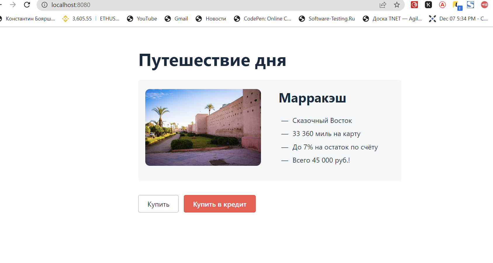
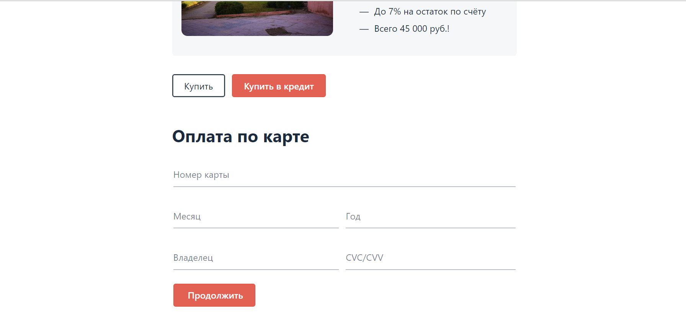

 # **План автоматизированного тестирования web-сервиса покупки тура**

главная страница сервиса покупки

#### Виды тестирования:
функциональное тестирование - тестирование перехода на веб-сервис, возможность оформления покупки тура 
по карте, в т.ч. валидации полей формы;

#### Уровни тестирования:
+ модульное тестирование - тестирование заполнения и отправки формы покупки тура;
+ интеграционное тестирование - взаимодействие с сервисами: платёжным и кредитным,
а также БД в момент заполнения и отправки формы покупки;

#### Валидными при заполнении полей ввода следует считать:

1. Номер карты: цифровые символы, 16 шт., в формате **** **** **** ****
2. Месяц: 01-12, но не ранее текущего месяца в случае, если указан текущий год
3. Год: последние две цифры порядкового номера года, не ранее текущего года
4. Владелец: буквенные символы латинского алфавита, количество от 1 до 64, с аппострофом, с дефисом.
5. CVC: цифровые символы, 3 шт.

#### Карты предоставленные для тестирования

+ 4444 4444 4444 4441, status: APPROVED
+ 4444 4444 4444 4442, status: DECLINED

#### заявлена поддержка двух СУБД:
+ MySQL
+ PostgreSQL

## Автоматизированные сценарии оплаты по карте

> Позитивные:

1. Дебетовая карта со статусом APPROVED
+ зайти на страницу покупки
+ нажать кнопку "купить" на главной странице
+ на открывшейся странице вводим валидные данные платильщика

+ кнопка продолжить

Ожидаемый результат: Оплата прошла успешно, банк одобрил операцию. Появилось уведомление о успешной
оплате с текстом "Успешно! Операция одобрена банком" В БД, в payment_entity, появилась запись 
со статусом APPROVED

2. Кредитная карта со статусом APPROVED
+ зайти на страницу покупки
+ нажать кнопку "Купить в кредит", на главной странице
+ на открывшейся странице, вводим валидные данные платильщика
  
+ кнопка продолжить

Ожидаемый результат: Оплата прошла успешно, банк одобрил операцию. Появилось уведомление о успешной
оплате с текстом "Успешно! Операция одобрена банком" В БД, в credit_request_entity, появилась запись со статусом APPROVED

> Негативные (продолжаем в этом-же сервисе и на этих же страницах):

1. Дебетовая карта со статусом DECLINED
+ зайти на страницу покупки
+ нажать кнопку "купить"
+ вводим валидные данные платильщика
+ кнопка продолжить

Ожидаемый результат: Оплата не прошла, банк операцию отклонил. Появилось сплывающе окно
с текстом "Ошибка! Отказ в проведении операции" В БД, появилась запись со статусом DECLINED

2. Кредитная карта со статусом DECLINED
+ зайти на страницу покупки
+ нажать кнопку "Купить в кредит"
+ вводим валидные данные платильщика
+ кнопка продолжить

Ожидаемый результат: Оплата не прошла, банк операцию отклонил. Появилось сплывающе окно
с текстом "Ошибка! Отказ в проведении операции" В БД появилась запись со статусом DECLINED

3. Указан невалидный номер, дебетовой карты
+ зайти на страницу покупки
+ нажать кнопку "Купить"
+ вводим валидные, а номера карты невалидные данные 
(буквенные значения, спецсимволы, с дефисом, апострафом,эмодзи)

Ожидаемый результат: кнопка продолжить не активна, не дает вводить данные

4. Указан невалидный номер, кредитной карты
+ зайти на страницу покупки
+ нажать кнопку "Купить в кредит"
+ вводим валидные, а номера карты невалидные данные
(буквенные значения, спецсимволы, с дефисом, апострафом,эмодзи)

Ожидаемый результат: кнопка продолжить не активна, не дает вводить данные

5. Дебетовая карта с истекшим сроком действия 
+ зайти на страницу покупки
+ нажать кнопку "Купить"
+ вводим валидные данные платильщика
+ кнопка продолжить

Ожидаемый результат: под полем появилось сообщение об ошибке "Неверно указан срок действия карты",
в БД новая запись не появилась

6. Введение не валидного месяца карты
+ зайти на страницу покупки
+ нажать кнопку "Купить"
+ вводим невалидные, месяц (например: число 13, 14 и прошедший месяц настоящего года)

Ожидаемый результат: под полем появилось сообщение об ошибке "Неверно указан срок действия карты",
в БД новая запись не появилась

7. Введение не валидного года карты
+ зайти на страницу покупки
+ нажать кнопку "Купить"
+ вводим невалидные год

Ожидаемый результат: под полем появилось сообщение об ошибке "Неверно указан срок действия карты",
в БД новая запись не появилась

8. Кредитная карта с истекшим сроком действия
+ зайти на страницу покупки
+ нажать кнопку "Купить в кредит"
+ вводим валидные данные платильщика
+ кнопка продолжить

Ожидаемый результат: под полем появилось сообщение об ошибке "Неверно указан срок действия карты",
в БД новая запись не появилась

9. Неверное значение в поле Владелец, дебетовой картой
+ зайти на страницу покупки
+ нажать кнопку "Купить"
+ вводим валидные, а поле Владелец невалидные данные (кирилица, спецсимволы, эмодзи, цифры)
+ кнопка продолжить

Ожидаемый результат: под полем появилось сообщение об ошибке "Неверно введены данные",
в БД новая запись не появилась

10. Граничное значение в поле Владелец, дебетовой картой
+ зайти на страницу покупки
+ нажать кнопку "Купить"
+ вводим валидные, но количество в поле Владелец (63,64,65,66 символа)

Ожидаемый результат: не дает ввести более 64 символов

11. Неверное значение в поле Владелец, кредитной картой(кирилица, спецсимволы, эмодзи, цифры)
+ зайти на страницу покупки
+ нажать кнопку "Купить в кредит"
+ вводим невалидные данные платильщика
+ кнопка продолжить

Ожидаемый результат: под полем появилось сообщение об ошибке "Неверно введены данные",
в БД новая запись не появилась

12. некорректное значение в поле CVC/CVV, дебетовой карты
+ зайти на страницу покупки
+ нажать кнопку "Купить"
+ вводим невалидные данные CVC/CVV
+ кнопка продолжить

Ожидаемый результат: под полем появилось сообщение об ошибке "Неверно введены данные",
в БД новая запись не появилась

13. некорректное значение в поле CVC/CVV, кредитной карты
+ зайти на страницу покупки
+ нажать кнопку "Купить в кредит"
+ вводим невалидные данные CVC/CVV
+ кнопка продолжить

Ожидаемый результат: под полем появилось сообщение об ошибке "Неверно введены данные",
в БД новая запись не появилась

14. Пустая форма заявки
+ зайти на страницу покупки
+ нажать кнопку "Купить"
+ нажать кнопка продолжить

Ожидаемый результат: кнопка продолжить не кликабельна, под полями появилось сообщение об ошибке 
"Обязательно для заполнения", в БД новая запись не появилась

## Используемые инструменты

1. JAVA **OpenJDK 11 и выше - т.к. используем инструменты работающие на JAVA (язык программирования);
2. IDE** intelliJ IDEA - инструмент дающий возможность одновременно работать команде, с возможностью 
кооректировки. обладает интуитивным интерфейсом, поддерживает все необходимые инструменты;
3. JUnit 5 (желательно) - инструмент тестирования, обладающий большим потенциалом
4. Gradle - система автоматизации сборки и управления зависимостями, позволяющий получать отчеты
5. Selenide - фреймворк для автоматизированного тестирования веб-приложений на основе Selenium WebDriver,
более удобный и простой в использовании, чем Selenium;
6. Faker - генерирует данные, приближенные к реальным.
7. Подключение к БД, с установленым одним из видов SQL(по необходимости запросов из БД)
8. DBeaver или Консольный клиент, для просмотра базы данных, если такое необходимо и создания запросов
9. Git и GitHub - для полноценной работы с фейморками и хранения автотестов
10. Docker Compose - инструмент, позволяющий запускать мультиконтейнерные приложения, чтобы 
не устанавливать на компьютер необходимые для работы приложения Node.js и СУБД;
11. Allure - фреймворк, предназначенный для создания отчетов, более наглядных, чем у Gradle;
12. Lombok- библиотека для сокращения количества шаблонного кода, для объявления локальной переменной
вместо указания реального типа;
13. SQL - язык структурированных запросов, предназначенным для описания, изменения и извлечения данных, 
хранимых в реляционных базах данных;

##  Риски при автоматизации
+ Изменение на странице может привести к падению тестов и необходимости их дальнейшего исправления;
+ При отсутствии уникальных локаторов, усложняет написание и поддержку тестов;
+ Отсутствием доступа к реальной БД и использовании Facker, может привести к потере отражения реальной статистики;
+ Неоправданная стоимость автоматизации;
+ Проблемы с соединением/сетью (зависимость тестового окружения от бесперебойной и качественной сети Интернет);
+ Процесс получения реальных данных может быть очень трудоемкий и принести дополнительную нагрузку для системы.

## Интервальная оценка с учётом рисков (в часах)

+ подготовка окружения, инфраструктуры, развертывание БД - 16 часов;
+ написание автотестов, тестирование и отладка автотестов - 56 часа;
+ формирование и анализ отчетов - 12 часов;

## План сдачи работ
1. Подготовка - 24.06.2022 года
2. Разработка и прогон тестов - 03.07.2022 года
3. Отчет - 06.07.2022 года