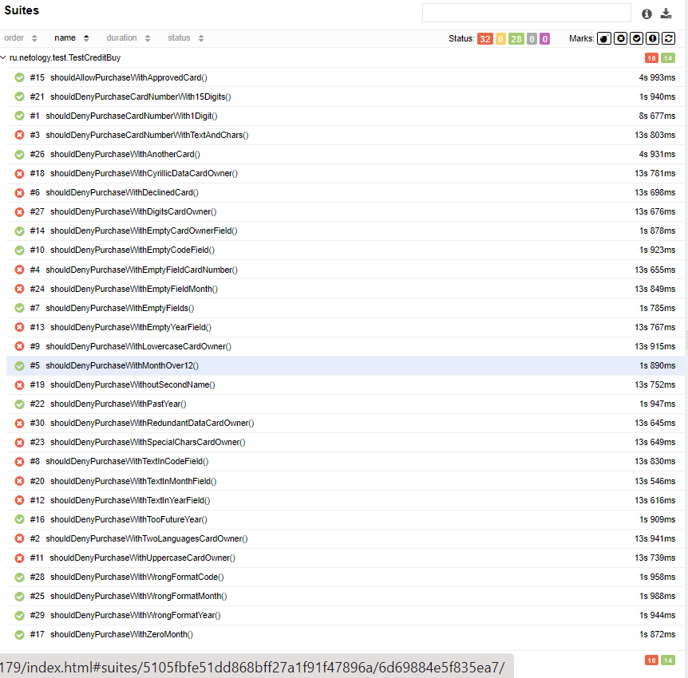
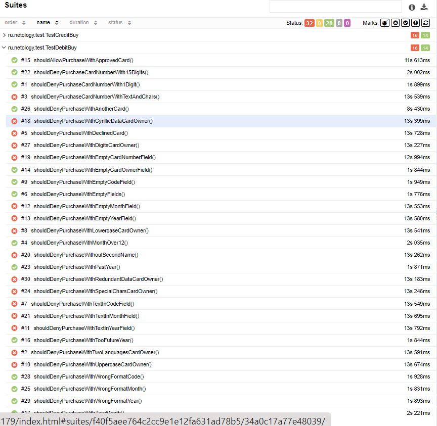

# **Отчет по итогам тестирования**
1. Описание

Тестирования было разделено на несколько этапов - исследовательское тестирование для ознакомления с проектом. 
После, в результате проведения автоматизации, тестирования были проверены позитивные и негативные 
сценарии покупки тура, тестирование UI, БД, API:

правильность отображения и работоспособность различных элементов веб-сервиса (форм для заполнения, кнопок, вкладок);
правильность появления и отображения различных уведомлений и предупреждений в зависимости от указываемых
валидных и невалидных данных; правильность взаимодействия веб-сервиса с двумя СУБД MySQL и PostgreSQL;
правильность сохраняемых в СУБД данных.

2. Результаты тестирования

общее количество тест-кейсов - 60 (для обеих СУБД)
количество успешных тест-кейсов - 28 (46,66%)
количество не успешных тест-кейсов - 32 (53,44%)

## Итого: 
по результатам тестирования были заведены следующие [issues](https://github.com/kpyatakov/diploma-qa/issues)

Результаты говорят о наличие дефектов в работе данного сервиса, 
следовательно не рекомендуется использовать его на данном этапе до устранения ошибок
и повторого тестирования.